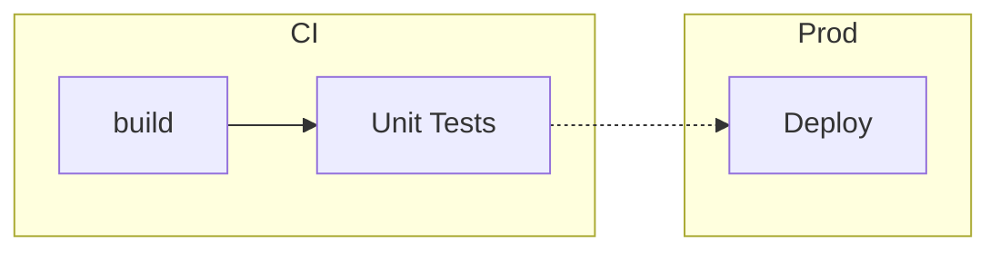
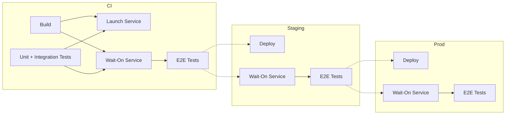
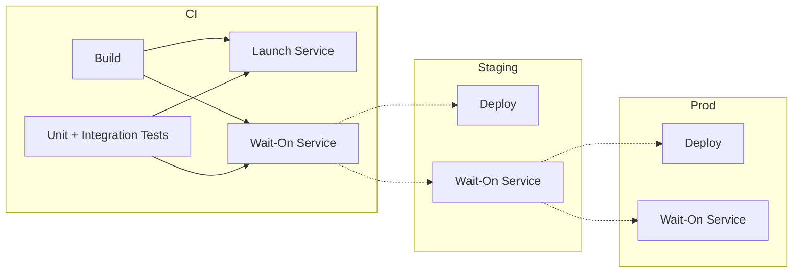
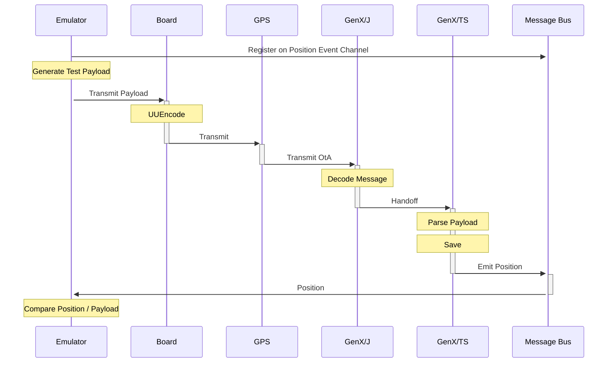

## Tester en Production

Pourquoi. Comment. Comment Pas.

---

### Précédemment aux TechnoDrinks

 

 

---

### Précédemment aux TechnoDrinks

---

## ToC

- Tester en Prod?
- Pourquoi
- Comment

---

## $ whoami

<!-- .slide: data-background="imgs/lightbulb.gif" -->

---

<!-- .slide: data-background="imgs/idontalwaystestmycode.jpg" -->

---

<!-- .slide: data-background="imgs/breaking-prod.png" -->

---

# Pourquoi

### Développer sur le serveur en prod

| Pros          | Cons            |
|---------------|-----------------|
| Vitesse + + + | Stabilité - - - |
|               | Max 1 Dev       |

--

# Pourquoi

### Développer local avec la BD de prod

| Pros           | Cons            |
|----------------|-----------------|
| Vitesse + + -  | Stabilité + - - |
|                | DB de Prod      |

--

# Pourquoi

### Développer local avec BD de dev

| Pros           | Cons                |
|----------------|---------------------|
| Vitesse + = -  | Stabilité + + ?     |
|                | Works on my Machine |

--

## Works on my Machine

- Service?
- Configuration?
- Secret?
- Data-Driven Behavior?
- Pipeline?
- ... ?

---

# Comment?

---

# Comment?

- Qu'est-ce qu'un test?
- Architecture du projet
- Qu'est-ce que je veux tester?

---

## Qu'est-ce qu'un test?

_*La longueur des segments n'est pas à l'échelle avec leur durée_

--

## Qu'est-ce qu'un test?

--

## Qu'est-ce qu'un test?

 

--

## Qu'est-ce qu'un test?

<!-- .slide: data-background="imgs/phone.png" -->

---

## Architecture

Programmes Interactifs vs Non-Interactifs

- Aucune interactivité
- Interactivité partielle
- Interactivité complète

--

### Programmes Non-Interactifs

--

### Programmes Interactifs

--

### Programmes Semi-Interactifs

--

### Interactivité

---

### Quels tests?

--

### Quels Tests?

- E2E
- Lifetime