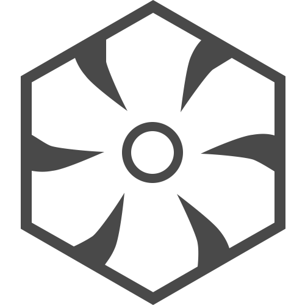
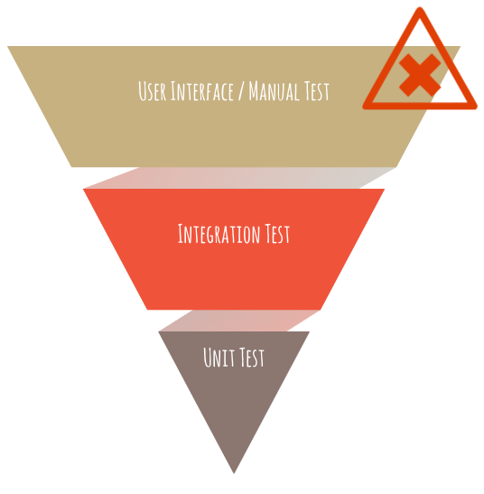
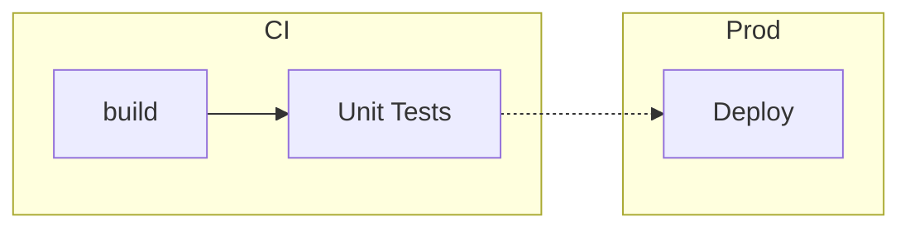
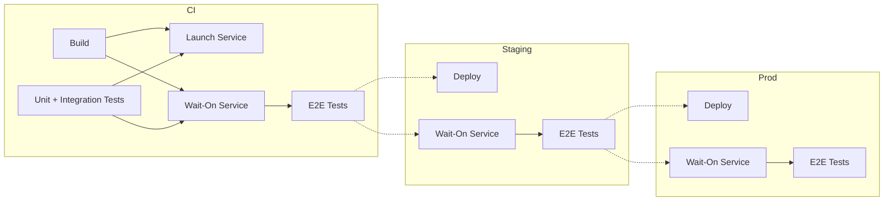
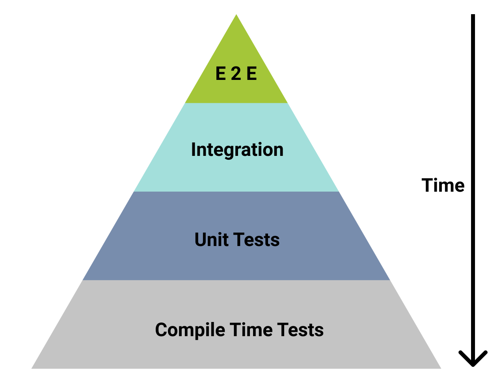

## Tester en Production

Pourquoi. Comment. Comment Pas.

---

### Précédemment aux TechnoDrinks

 

 

---

### Précédemment aux TechnoDrinks

---

## ToC

- Pourquoi
- Comment

---

## $ whoami

<!-- .slide: data-background="imgs/lightbulb.gif" -->

---

<!-- .slide: data-background="imgs/breaking-prod.png" -->

---

# Pourquoi

### Développer sur le serveur en prod

| Pros          | Cons            |
|---------------|-----------------|
| Vitesse + + + | Stabilité - - - |
|               | Max 1 Dev       |

--

# Pourquoi

### Développer local avec la BD de prod

| Pros           | Cons            |
|----------------|-----------------|
| Vitesse + + -  | Stabilité + - - |
| Multiples Devs |                 |

--

# Pourquoi

### Développer local avec BD de dev

| Pros           | Cons                |
|----------------|---------------------|
| Vitesse + = -  | Stabilité + + ?     |
| Multiples Devs | Works on my Machine |

--

## Works on my Machine

- Service?
- Configuration?
- Secret?
- Data-Driven Behavior?
- Pipeline?

---

# Comment?

- Architecture du projet
- Qu'est-ce que je veux tester?

---

## Architecture

Programmes Interractifs vs Non-Interractifs

- Aucune interractivité
- Interractivité partielle
- Interractivité complète

---

### Programmes Non-Interractifs

---

### Programmes Interractifs

---

### Quels tests?

--

### Quels Tests?

- E2E